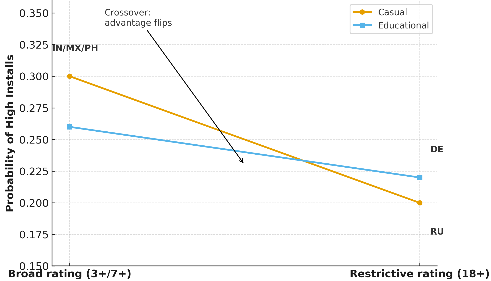
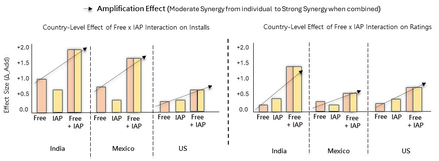
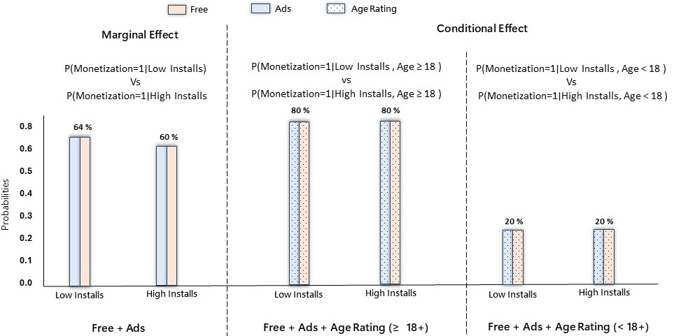
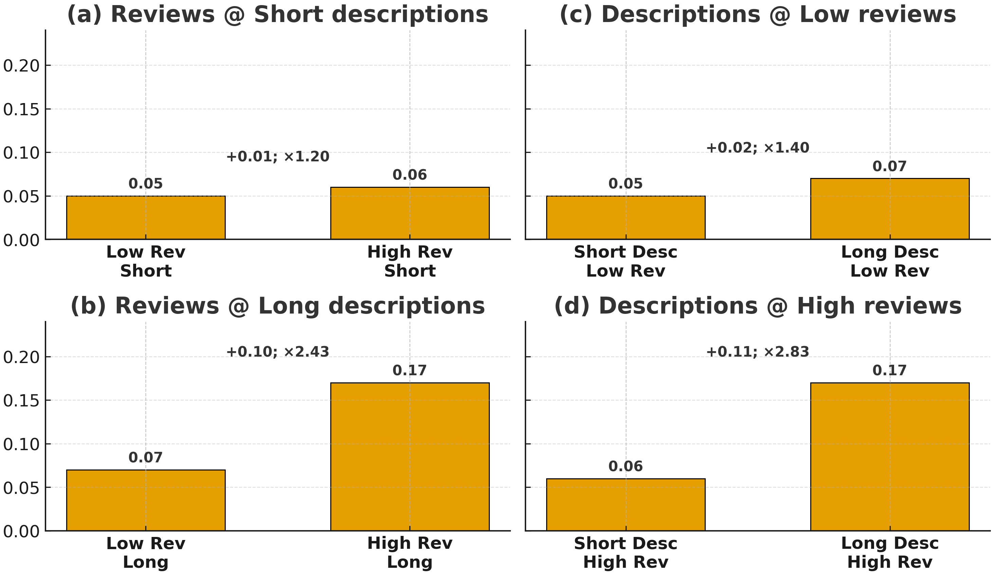
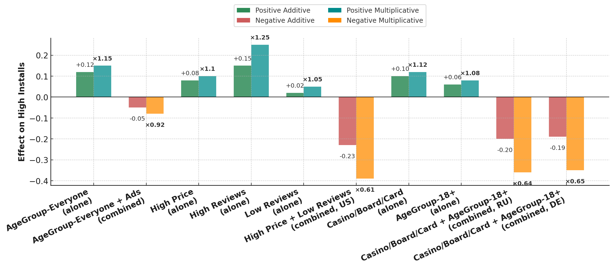

# Interaction Principles

The **Interaction-Analysis Framework** developed in this research draws on established principles of interaction and effect-measure modification from epidemiology and translates them to contextual questions in game research.

The central principle is that an empirical relationship observed overall does not necessarily remain equivalent across the conditions in which it is observed.

> **Core idea:**  
> A relationship can strengthen, weaken, disappear, or change direction across contexts.

This page develops these principles progressively. Each concept is introduced from the methodological literature, expressed statistically, translated to the game-research setting, and, where appropriate, illustrated using game-marketplace examples.

---

# 1. Interaction, Effect Modification, and Effect-Measure Modification

The epidemiological literature uses **interaction**, **effect modification**, and **effect-measure modification** for closely related but distinguishable ideas.

A useful starting point is to distinguish whether the question concerns the **joint relationship of two factors** or whether the relationship of **one focal factor varies across levels of another factor**.

```text
                         CONTEXTUAL DEPENDENCE
                                  │
                 ┌────────────────┴────────────────┐
                 │                                 │
                 ▼                                 ▼
        JOINT RELATIONSHIP                 STRATUM-SPECIFIC
           OF r AND c                     RELATIONSHIP OF r
                 │                                 │
                 ▼                                 ▼
           INTERACTION                    EFFECT MODIFICATION
                                                   │
                                                   ▼
                                      EFFECT-MEASURE MODIFICATION
                                      when defined for a specific
                                             effect measure
```

Knol and VanderWeele distinguish these analytical questions by separating the examination of the effect of one exposure across strata of another factor from examination of the joint effects of two exposures.

**Methodological source:**  
Knol MJ, VanderWeele TJ. *Recommendations for presenting analyses of effect modification and interaction.* International Journal of Epidemiology. 2012;41(2):514–520.  
**[DOI: 10.1093/ije/dyr218](https://doi.org/10.1093/ije/dyr218)**

---

## 1.1 Interaction

### The principle

**Interaction concerns the joint relationship of two factors with an outcome and whether that joint relationship departs from a specified no-interaction reference.**

Let:

- \(r\) = first factor
- \(c\) = second factor
- \(y\) = outcome

For two binary factors, four joint conditions are possible:

| | c̄ | c |
|---|---:|---:|
| **r̄** | p<sub>y\|r̄c̄</sub> | p<sub>y\|r̄c</sub> |
| **r** | p<sub>y\|rc̄</sub> | p<sub>y\|rc</sub> |

where

```math
p_{y\mid rc}=P(y\mid r,c).
```

Thus,

```math
p_{y\mid\bar r\bar c}=P(y\mid\bar r,\bar c)
```

is the outcome probability when neither factor is present, whereas

```math
p_{y\mid rc}=P(y\mid r,c)
```

is the outcome probability when both factors are present.

These four conditions provide the basic structure from which interaction can be evaluated.

### What makes it an interaction?

A large value of \(p_{y\mid rc}\) is **not, by itself, evidence of interaction**.

The critical question is whether the observed joint relationship differs from the relationship expected from the separate relationships of \(r\) and \(c\) under a specified **no-interaction model**.

```text
Observed joint relationship
           │
           ▼
       p(y | r,c)
           │
           │ compare with
           ▼
Expected joint relationship
under a no-interaction model
           │
           ▼
 Departure from expectation?
       /               \
     NO                 YES
     │                   │
No interaction       Interaction
on that scale        on that scale
```

What counts as the expected joint relationship depends on the **scale** on which interaction is evaluated.

---

### Additive reference

On the probability-difference scale, the individual relationships associated with \(r\) and \(c\) can be written as

```math
PD_r=p_{y\mid r\bar c}-p_{y\mid\bar r\bar c}
```

and

```math
PD_c=p_{y\mid\bar r c}-p_{y\mid\bar r\bar c}.
```

Under an additive no-interaction model, the expected joint probability is

```math
p_{y\mid rc}^{(\mathrm{expected})}
=
p_{y\mid r\bar c}+p_{y\mid\bar r c}-p_{y\mid\bar r\bar c}.
```

The departure from additivity is therefore

```math
IC_{\mathrm{add}}
=
p_{y\mid rc}-p_{y\mid r\bar c}-p_{y\mid\bar r c}+p_{y\mid\bar r\bar c}.
```

The additive null is

```math
IC_{\mathrm{add}}=0.
```

A non-zero value represents departure from the additive no-interaction reference.

---

### Multiplicative reference

A different reference is obtained when relationships are represented on a relative scale.

For example, using risk ratios,

```math
RR_{10}=\frac{p_{y\mid r\bar c}}{p_{y\mid\bar r\bar c}},
\qquad
RR_{01}=\frac{p_{y\mid\bar r c}}{p_{y\mid\bar r\bar c}},
\qquad
RR_{11}=\frac{p_{y\mid rc}}{p_{y\mid\bar r\bar c}}.
```

Under a multiplicative no-interaction model,

```math
RR_{11}^{(\mathrm{expected})}
=
RR_{10}\times RR_{01}.
```

Departure from multiplicativity can therefore be represented by

```math
IC_{\mathrm{mult}}
=
\frac{RR_{11}}
     {RR_{10}RR_{01}}.
```

The multiplicative null is

```math
IC_{\mathrm{mult}}=1.
```

This leads to an important principle:

> **Interaction is scale dependent.**

```text
                 SAME FOUR JOINT CONDITIONS
                           │
                    p(y|r̄c̄) p(y|rc̄) p(y|r̄c) p(y|rc)
                           │
             ┌─────────────┴─────────────┐
             ▼                           ▼
       ADDITIVE SCALE             MULTIPLICATIVE SCALE
             │                           │
       No interaction:             No interaction:
             0                           1
             │                           │
             └─────────────┬─────────────┘
                           ▼
                   Conclusions need
                  not be equivalent
```

The same data can therefore show departure from additivity, departure from multiplicativity, departure from both, or departure from neither.

**Methodological sources:**  

Greenland S. *Tests for interaction in epidemiologic studies: A review and a study of power.* Statistics in Medicine. 1983;2(2):243–251.  
**[DOI: 10.1002/sim.4780020219](https://doi.org/10.1002/sim.4780020219)**

Knol MJ, VanderWeele TJ. *Recommendations for presenting analyses of effect modification and interaction.* International Journal of Epidemiology. 2012;41(2):514–520.  
**[DOI: 10.1093/ije/dyr218](https://doi.org/10.1093/ije/dyr218)**

---

### Translation to game research

The same structure can be used when \(r\) and \(c\) represent characteristics of games rather than epidemiological exposures.

For example:

```text
r = Free
c = Offers IAP
y = Marketplace success
```
This gives four conditions:

| | No IAP (c̄) | IAP (c) |
|---|---:|---:|
| **Not Free (r̄)** | p<sub>y\|r̄c̄</sub> | p<sub>y\|r̄c</sub> |
| **Free (r)** | p<sub>y\|rc̄</sub> | p<sub>y\|rc</sub> |

The interaction question is **not simply whether Free + IAP games have high marketplace success**.

Instead, the question is:

> **Is the joint Free × IAP relationship with marketplace success different from what would be expected from the separate Free and IAP relationships under the specified interaction scale?**

This distinction becomes important when specific interaction patterns are introduced later on this page.

---

## 1.2 Effect Modification

Interaction can focus on the joint relationship of two factors. **Effect modification changes the orientation of the question.**

Suppose:

- \(r\) = focal factor
- \(c\) = modifying factor
- \(y\) = outcome

Instead of primarily evaluating the joint \(r \times c\) relationship, the relationship between \(r\) and \(y\) is examined within different levels of \(c\):

```math
M(r,y\mid\bar c)
```

versus

```math
M(r,y\mid c).
```

Conceptually:

```text
                     r ─────────────► y
                     │
                     │
              Does this relationship
                  depend on c?
                     │
          ┌──────────┴──────────┐
          ▼                     ▼
          c̄                     c
          │                     │
          ▼                     ▼
     r ─────► y            r ─────────► y
      relationship          relationship
          │                     │
          └──────────┬──────────┘
                     ▼
                   Compare
```

If the relationship differs across levels of \(c\), the \(r\)–\(y\) relationship is modified across \(c\).

The conceptual distinction can therefore be expressed as:

```text
INTERACTION

"What happens when r and c occur jointly?"

                    versus

EFFECT MODIFICATION

"Does the r–y relationship differ across levels of c?"
```

**Methodological source:**  
Knol MJ, VanderWeele TJ. *Recommendations for presenting analyses of effect modification and interaction.* International Journal of Epidemiology. 2012;41(2):514–520.  
**[DOI: 10.1093/ije/dyr218](https://doi.org/10.1093/ije/dyr218)**

---

### Translation to game research

Let:

```text
r = Ads
c = Game genre
y = Marketplace success
```

The question becomes:

> **Does the Ads–marketplace-success relationship differ across game genres?**

Conceptually:

```text
                    ADS
                     │
                     ▼
             MARKETPLACE SUCCESS
                     │
              examined within
                     │
       ┌─────────────┼─────────────┐
       ▼             ▼             ▼
     Puzzle         RPG         Strategy
       │             │             │
   Ads–success   Ads–success   Ads–success
   relationship  relationship  relationship
       │             │             │
       └─────────────┼─────────────┘
                     ▼
          Are they equivalent?
```

The same question can be extended to other contexts:

```text
Ads ──► Success | Genre

Ads ──► Success | Country

Ads ──► Success | Time
```

The substantive question is therefore no longer merely whether Ads and marketplace success are associated overall, but whether the observed relationship is **context dependent**.

---

## 1.3 Effect-Measure Modification

The term **effect-measure modification (EMM)** makes an important additional distinction.

What varies across contexts is a **specified measure of the relationship**.

Greenland distinguishes variation in a chosen effect measure across levels of a background variable as **effect-measure modification**.

**Methodological source:**  
Greenland S. *Effect Modification and Interaction.* Wiley StatsRef: Statistics Reference Online.  
**[DOI: 10.1002/9781118445112.stat03728.pub2](https://doi.org/10.1002/9781118445112.stat03728.pub2)**

### Formal representation

Let \(M\) denote a chosen measure of the \(r\)–\(y\) relationship.

Effect-measure modification can be represented as

```math
M(r,y\mid\bar c)
\neq
M(r,y\mid c).
```

More generally, across \(K\) contexts:

```math
M(r,y\mid c),\;
M(r,y\mid c_2),\;
\dots,\;
M(r,y\mid c_K)
```

need not be homogeneous.

The important point is that the conclusion depends on **what \(M\) represents**.

For example,

```math
M_{\mathrm{add}}
=
\text{Probability Difference}
```

and

```math
M_{\mathrm{mult}}
=
\text{Relative Measure}
```

represent the relationship on different scales.

Therefore:

```text
                    r ─────► y
                        │
                  conditioned on c
                        │
             ┌──────────┴──────────┐
             │                     │
             ▼                     ▼
       ADDITIVE MEASURE     MULTIPLICATIVE MEASURE
             │                     │
       M_add(r,y|c)          M_mult(r,y|c)
             │                     │
             └──────────┬──────────┘
                        ▼
              Contextual conclusions
                can differ by scale
```

A relationship can therefore exhibit effect-measure modification on one scale without exhibiting the same pattern on another scale.

This is why specifying the measure is important rather than simply stating that an "effect is modified."

**Methodological source:**  
Brumback BA. *On effect-measure modification: Relationships among changes in the relative risk, odds ratio, and risk difference.* Statistics in Medicine. 2008;27(18):3453–3465.  
**[DOI: 10.1002/sim.3246](https://doi.org/10.1002/sim.3246)**

---

### Translation to the Interaction-Analysis Framework

This distinction is particularly important for the present framework.

The observational question is not simply:

> *Does monetization work differently in different contexts?*

Rather, it is:

> **Does the measured relationship between monetization and marketplace success vary across the contexts represented in the data?**

For example:

```text
                    ADS
                     │
                     ▼
               INSTALL SUCCESS
                     │
              examined across
                     │
       ┌─────────────┼─────────────┐
       ▼             ▼             ▼
     Genre         Country         Time
       │             │             │
       └─────────────┼─────────────┘
                     ▼
              MEASURED ON
                     │
          ┌──────────┴──────────┐
          ▼                     ▼
       ADDITIVE             MULTIPLICATIVE
         DDP                     RoR
          │                       │
          └──────────┬────────────┘
                     ▼
             CONTEXTUAL PROFILE
```

The framework therefore evaluates contextual variation on both additive and multiplicative scales rather than assuming that a relationship characterized on one measure fully describes its contextual behavior.

---

## 1.4 The Three Concepts at a Glance

```text
┌──────────────────────────────────────────────────────────────┐
│                         INTERACTION                          │
│                                                              │
│  Do r and c jointly depart from the relationship expected   │
│  from their separate relationships on a specified scale?    │
└──────────────────────────────────────────────────────────────┘
                              │
                              ▼
┌──────────────────────────────────────────────────────────────┐
│                    EFFECT MODIFICATION                       │
│                                                              │
│  Does the relationship between r and y differ across        │
│  levels of c?                                               │
└──────────────────────────────────────────────────────────────┘
                              │
                              ▼
┌──────────────────────────────────────────────────────────────┐
│                EFFECT-MEASURE MODIFICATION                   │
│                                                              │
│  Does a specified measure of the r–y relationship differ    │
│  across levels of c?                                        │
└──────────────────────────────────────────────────────────────┘
```

These concepts provide the foundation for the interaction principles developed in the following sections.

The next step is to distinguish **additive and multiplicative interaction**, define the corresponding **no-interaction reference on each scale**, and examine how departures from those references can be interpreted.

---

# 2. Additive and Multiplicative Interaction

Interaction has no single scale-independent definition. The same four outcome
probabilities can be compared using different reference models, and the
conclusion about interaction can depend on the scale chosen.

For the two factors \(r\) and \(c\), the four success probabilities are:

| | c̄ | c |
|---|---:|---:|
| **r̄** | p<sub>y\|r̄c̄</sub> | p<sub>y\|r̄c</sub> |
| **r** | p<sub>y\|rc̄</sub> | p<sub>y\|rc</sub> |

The question is not simply whether these probabilities differ. The question is
whether the relationship associated with \(r\) changes across \(c\), relative
to a particular **no-interaction reference**.

```text
                         SAME FOUR PROBABILITIES
                                  │
                                  ▼
                 What counts as "no interaction"?
                                  │
                    ┌─────────────┴─────────────┐
                    │                           │
                    ▼                           ▼
             ADDITIVE SCALE              MULTIPLICATIVE SCALE
                    │                           │
             Differences are                Ratios are
                compared                     compared
                    │                           │
                    ▼                           ▼
               Null = 0                     Null = 1
```
This distinction between additive and multiplicative interaction is well
established in epidemiological methodology, where evidence of interaction
can depend on the scale on which the joint relationship is evaluated.

**Methodological source:**  
VanderWeele TJ, Knol MJ. *A Tutorial on Interaction.* Epidemiologic Methods.
2014;3(1):33–72.  
**[DOI: 10.1515/em-2013-0005](https://doi.org/10.1515/em-2013-0005)**
---

## 2.1 Additive Interaction

### Comparing differences

On the additive scale, the relationship is expressed as an **absolute
difference in outcome probabilities**.

Within \(c\), the probability difference associated with \(r\) is:

```math
PD_{r\mid c}
=
p_{y\mid rc}
-
p_{y\mid\bar r c}.
```

Within \(\bar c\), the corresponding probability difference is:

```math
PD_{r\mid\bar c}
=
p_{y\mid r\bar c}
-
p_{y\mid\bar r\bar c}.
```

Additive interaction asks whether these two differences are equal:

```math
PD_{r\mid c}
\stackrel{?}{=}
PD_{r\mid\bar c}.
```

Their difference gives the **difference in differences of probabilities
(DDP)**:

```math
\mathrm{DDP}
=
PD_{r\mid c}
-
PD_{r\mid\bar c}.
```

Expanding the expression:

```math
\mathrm{DDP}
=
\left(
p_{y\mid rc}
-
p_{y\mid\bar r c}
\right)
-
\left(
p_{y\mid r\bar c}
-
p_{y\mid\bar r\bar c}
\right).
```

Equivalently:

```math
\boxed{
\mathrm{DDP}
=
p_{y\mid rc}
-
p_{y\mid\bar r c}
-
p_{y\mid r\bar c}
+
p_{y\mid\bar r\bar c}
}
```

The additive no-interaction condition is:

```math
\boxed{\mathrm{DDP}=0}
```

because this means:

```math
PD_{r\mid c}
=
PD_{r\mid\bar c}.
```

In other words, the absolute probability difference associated with \(r\)
is the same whether \(c\) is present or absent.

---

### Reading the additive scale

```text
DDP < 0                    DDP = 0                    DDP > 0
   │                          │                          │
   ▼                          ▼                          ▼
Negative departure       No departure             Positive departure
from additivity          from additivity           from additivity
```

Thus, the sign of DDP describes the **direction of departure from the
additive reference**.

Importantly, a positive DDP does not simply mean that the joint group has a
high probability of success, and a negative DDP does not simply mean that it
has a low probability.

The quantity describes how far the observed joint pattern departs from the
pattern expected under additivity.

---

### A simple numerical example

Suppose:

```math
p_{y\mid\bar r\bar c}=0.20,
\qquad
p_{y\mid r\bar c}=0.30,
```

```math
p_{y\mid\bar r c}=0.40,
\qquad
p_{y\mid rc}=0.65.
```

The relationship associated with \(r\) when \(c\) is absent is:

```math
PD_{r\mid\bar c}
=
0.30-0.20
=
0.10.
```

When \(c\) is present:

```math
PD_{r\mid c}
=
0.65-0.40
=
0.25.
```

Therefore:

```math
\mathrm{DDP}
=
0.25-0.10
=
0.15.
```

The positive value indicates that the probability difference associated with
\(r\) is **0.15 larger in the presence of \(c\)** than in its absence.

Visually:

```text
                     r̄                     r
                     │                      │

c̄                  0.20 ───── +0.10 ───► 0.30

c                   0.40 ───── +0.25 ───► 0.65
                                     
                         difference
                         in differences
                              │
                              ▼
                         0.25 - 0.10
                              │
                              ▼
                         DDP = +0.15
```

This is a **positive departure from additivity**.

---

### Game-research interpretation

Suppose:

```text
r = Ads
c = RPG
y = Install success
```

Then:

```math
PD_{r\mid c}
```

represents the Ads–install-success probability difference among RPG games,
whereas

```math
PD_{r\mid\bar c}
```

represents the corresponding Ads–install-success probability difference among
non-RPG games.

The DDP therefore asks:

> **How much does the Ads–install-success probability difference change when
> moving from non-RPG to RPG games?**

This provides an additive measure of contextual variation in the observed
Ads–success relationship.

---

## 2.2 Multiplicative Interaction

### Comparing relative relationships

The same four probabilities can be examined on a multiplicative scale.

In the present framework, the outcome probabilities are first transformed to
odds:

```math
o_{y\mid rc}
=
\frac{p_{y\mid rc}}
     {1-p_{y\mid rc}}.
```

Analogously:

```math
o_{y\mid\bar r c},
\qquad
o_{y\mid r\bar c},
\qquad
o_{y\mid\bar r\bar c}.
```

Within \(c\), the conditional odds ratio for the association between \(r\)
and \(y\) is:

```math
\theta_{yr\mid c}
=
\frac{o_{y\mid rc}}
     {o_{y\mid\bar r c}}.
```

Within \(\bar c\):

```math
\theta_{yr\mid\bar c}
=
\frac{o_{y\mid r\bar c}}
     {o_{y\mid\bar r\bar c}}.
```

Multiplicative interaction asks whether these conditional odds ratios are
equal:

```math
\theta_{yr\mid c}
\stackrel{?}{=}
\theta_{yr\mid\bar c}.
```

Their ratio gives the **ratio of odds ratios (RoR)**:

```math
\boxed{
\mathrm{RoR}
=
\frac{\theta_{yr\mid c}}
     {\theta_{yr\mid\bar c}}
}
```

The multiplicative no-interaction condition is:

```math
\boxed{\mathrm{RoR}=1}
```

because:

```math
\mathrm{RoR}=1
\iff
\theta_{yr\mid c}
=
\theta_{yr\mid\bar c}.
```

Thus, RoR evaluates whether the odds-ratio association between \(r\) and \(y\)
is homogeneous across the two conditions defined by \(c\).

---

### Reading the multiplicative scale

```text
RoR < 1                    RoR = 1                    RoR > 1
   │                          │                          │
   ▼                          ▼                          ▼
Negative departure       No departure             Positive departure
from multiplicativity    from multiplicativity     from multiplicativity
```

Again, these values describe **departure from the multiplicative reference**.
They should not be interpreted simply as low, neutral, or high marketplace
success.

---

## 2.3 Why the Two Scales Can Disagree

Additive and multiplicative interaction ask different mathematical questions.

```text
ADDITIVE

Does the probability difference change across c?

PD_r|c  versus  PD_r|c̄

              │
              ▼
             DDP


MULTIPLICATIVE

Does the odds ratio change across c?

θ_yr|c  versus  θ_yr|c̄

              │
              ▼
             RoR
```

Therefore:

```math
\mathrm{DDP}=0
```

does **not** mathematically require

```math
\mathrm{RoR}=1,
```

and conversely,

```math
\mathrm{RoR}=1
```

does not require

```math
\mathrm{DDP}=0.
```

This gives four possible analytical patterns:

| Additive scale | Multiplicative scale | Interpretation |
|---|---|---|
| DDP = 0 | RoR = 1 | No departure on either scale |
| DDP ≠ 0 | RoR = 1 | Departure from additivity only |
| DDP = 0 | RoR ≠ 1 | Departure from multiplicativity only |
| DDP ≠ 0 | RoR ≠ 1 | Departure on both scales |

The two measures should therefore be interpreted as **complementary
descriptions of the same four-cell probability structure**, rather than as
competing tests that must necessarily reach the same conclusion.

---

## 2.4 From Epidemiological Measures to the Present Framework

Epidemiological research has long emphasized that interaction can be evaluated
on different scales. Additive interaction is commonly represented using
measures such as the **relative excess risk due to interaction (RERI)**,
attributable proportion due to interaction, and synergy index, whereas
multiplicative interaction can be assessed through relative measures and
product terms.

The present framework follows the same underlying principle of
**scale-specific departure from a no-interaction reference**, but expresses
the two comparisons directly through:

```text
                  INTERACTION ANALYSIS
                          │
             ┌────────────┴────────────┐
             │                         │
             ▼                         ▼
      ADDITIVE SCALE            MULTIPLICATIVE SCALE
             │                         │
             ▼                         ▼
            DDP                       RoR
             │                         │
       Null value = 0            Null value = 1
             │                         │
             └────────────┬────────────┘
                          ▼
                95% confidence intervals
                          │
                          ▼
               Context-specific profile
```

This distinction is important: **DDP and RoR are the measures used in this
framework**, while measures such as RERI belong to related epidemiological
formulations of additive interaction.

**Methodological sources:**  

Andersson T, Alfredsson L, Källberg H, Zdravkovic S, Ahlbom A.
*Calculating measures of biological interaction.* European Journal of Epidemiology.
2005;20(7):575–579.  
**[DOI: 10.1007/s10654-005-7835-x](https://doi.org/10.1007/s10654-005-7835-x)**

Richardson DB, Kaufman JS. *Estimation of the Relative Excess Risk Due to
Interaction and Associated Confidence Bounds.* American Journal of Epidemiology.
2009;169(6):756–760.  
**[DOI: 10.1093/aje/kwn411](https://doi.org/10.1093/aje/kwn411)**

Knol MJ, VanderWeele TJ, Groenwold RHH, Klungel OH, Rovers MM, Grobbee DE.
*Estimating measures of interaction on an additive scale for preventive
exposures.* European Journal of Epidemiology. 2011;26:433–438.  
**[DOI: 10.1007/s10654-011-9554-9](https://doi.org/10.1007/s10654-011-9554-9)**

Knol MJ, VanderWeele TJ. *Recommendations for presenting analyses of effect
modification and interaction.* International Journal of Epidemiology.
2012;41(2):514–520.  
**[DOI: 10.1093/ije/dyr218](https://doi.org/10.1093/ije/dyr218)**

---

## 2.5 Why Both Scales Are Retained

Using both scales allows the contextual pattern to be examined without making
one scale the sole definition of interaction.

For every contextual comparison, the framework therefore asks two parallel
questions:

```text
1. ADDITIVE
   Does the absolute probability difference vary across the context?
                         │
                         ▼
                        DDP


2. MULTIPLICATIVE
   Does the odds-ratio association vary across the context?
                         │
                         ▼
                        RoR
```

Together, these measures provide two complementary views of how an observed
relationship changes across context.

The next sections examine the **forms that these departures can take**,
including positive and negative departures, amplification and attenuation,
crossover patterns, conditional independence, and related contextual
structures.


# 3. Patterns of Interaction

Once interaction has been established as a departure from a specified
no-interaction reference, the next question concerns the **form of that
departure**.

Two distinctions are especially useful. First, the relationship may retain
the same direction across contexts while changing in magnitude. Second, the
relationship may change direction across contexts. These are commonly
described as **quantitative** and **qualitative (or crossover) interaction**,
respectively.

**Methodological source:**  
VanderWeele TJ, Knol MJ. *A Tutorial on Interaction.* Epidemiologic Methods.
2014;3(1):33–72.  
**[DOI: 10.1515/em-2013-0005](https://doi.org/10.1515/em-2013-0005)**

```text
                    CONTEXTUAL VARIATION
                            │
                ┌───────────┴───────────┐
                │                       │
                ▼                       ▼
        SAME DIRECTION            DIRECTION CHANGES
        different magnitude       across context
                │                       │
                ▼                       ▼
          QUANTITATIVE             QUALITATIVE /
          INTERACTION               CROSSOVER
```

---

## 3.1 Quantitative Interaction: Same Direction, Different Magnitude

A **quantitative interaction** occurs when the relationship of a focal factor
with the outcome remains in the same direction across levels of another
factor, but its magnitude differs.

Using the notation developed above, suppose the relationship associated with
\(r\) is examined within \(c\) and \(\bar c\).

On the probability-difference scale:

```math
PD_{r\mid c}
=
p_{y\mid rc}
-
p_{y\mid\bar r c}
```

and

```math
PD_{r\mid\bar c}
=
p_{y\mid r\bar c}
-
p_{y\mid\bar r\bar c}.
```

A quantitative interaction can occur when, for example,

```math
PD_{r\mid c}>0
\qquad\text{and}\qquad
PD_{r\mid\bar c}>0,
```

but

```math
PD_{r\mid c}
\neq
PD_{r\mid\bar c}.
```

Thus, the **direction is retained**, but the **magnitude changes**.

```text
                    RELATIONSHIP OF r WITH y

c̄                  ───────────────►
                       positive

c                   ───────────────────────────►
                              positive

                    same direction
                    different magnitude
                           │
                           ▼
                 QUANTITATIVE INTERACTION
```

The same principle applies when both relationships are negative:

```math
PD_{r\mid c}<0
\qquad\text{and}\qquad
PD_{r\mid\bar c}<0,
```

while their magnitudes differ.

Therefore, quantitative interaction does **not** require a reversal of the
relationship. Context can modify how strongly a relationship is observed
while its direction remains unchanged.

### Game-research interpretation

Suppose:

```text
r = Ads
c = Game genre
y = Install success
```

Ads may be positively associated with install success in two genres while the
magnitude of that association differs substantially between them.

```text
Genre A       Ads ─────────► Install success
                    +0.08

Genre B       Ads ───────────────────► Install success
                              +0.25
```

Both relationships point in the same direction, but they are not equivalent
in magnitude.

The substantive conclusion is therefore not that Ads are associated with
success in one genre and failure in another. Rather, the **strength of the
observed Ads–success relationship depends on gameplay context**.

This distinction is particularly important for contextual analysis because an
overall relationship may conceal substantial variation in magnitude even when
its direction appears stable across contexts.

---

### Quantitative interaction is not the same as positive interaction

The word **quantitative** should not be confused with the sign of the
interaction measure.

For example, suppose:

```math
PD_{r\mid\bar c}=0.25
```

and

```math
PD_{r\mid c}=0.10.
```

Both relationships remain positive, so their directions agree. However,

```math
\mathrm{DDP}
=
0.10-0.25
=
-0.15.
```

Thus:

```text
Both stratum-specific relationships are positive
                    │
                    ▼
        Same direction across context
                    │
                    ▼
          QUANTITATIVE INTERACTION

BUT

Relationship is weaker within c
                    │
                    ▼
              DDP = -0.15
                    │
                    ▼
      NEGATIVE DEPARTURE FROM ADDITIVITY
```

This distinction is fundamental:

> **The direction of the interaction measure is not the same thing as the
> direction of the underlying stratum-specific relationships.**

A negative DDP can therefore arise even when the focal relationship remains
positive in both contexts, just as a positive DDP can arise when two negative
relationships differ in magnitude.

The sign of DDP describes the **direction of departure from the additive
reference**, whereas the signs of the stratum-specific probability
differences describe the **direction of the underlying relationships**.

## 3.2 Qualitative / Crossover Interaction

A stronger form of contextual variation occurs when the relationship between
\(r\) and \(y\) **changes direction across levels of \(c\)**.

This is commonly described as **qualitative interaction** or **crossover
interaction**.

Where quantitative interaction preserves the direction of the relationship,
qualitative interaction does not.

```text
                    RELATIONSHIP OF r WITH y
                              │
               ┌──────────────┴──────────────┐
               │                             │
               ▼                             ▼
       QUANTITATIVE                    QUALITATIVE /
        INTERACTION                      CROSSOVER
               │                             │
      direction retained              direction changes
      magnitude changes                across context
```
### Game-data example



*Illustrative game-marketplace example of qualitative interaction. The
relationship changes direction across the contextual condition, producing a
crossover pattern.*

**Methodological source:**  
VanderWeele TJ, Knol MJ. *A Tutorial on Interaction.* Epidemiologic Methods.
2014;3(1):33–72.  
**[DOI: 10.1515/em-2013-0005](https://doi.org/10.1515/em-2013-0005)**

---

### Direction reversal across context

Using the probability-difference formulation developed above, consider the
relationship associated with \(r\) within \(c\):

```math
PD_{r\mid c}
=
p_{y\mid rc}
-
p_{y\mid\bar r c}
```

and within \(\bar c\):

```math
PD_{r\mid\bar c}
=
p_{y\mid r\bar c}
-
p_{y\mid\bar r\bar c}.
```

A qualitative interaction occurs when these relationships have **opposite
directions**.

For example:

```math
PD_{r\mid\bar c}>0
\qquad\text{and}\qquad
PD_{r\mid c}<0.
```

or conversely:

```math
PD_{r\mid\bar c}<0
\qquad\text{and}\qquad
PD_{r\mid c}>0.
```

The important feature is therefore the sign reversal:

```math
\boxed{
PD_{r\mid c}\times PD_{r\mid\bar c}<0
}
```

Conceptually:

```text
c̄                    r̄ ─────────────► r
                         positive
                            │
                            │ context changes
                            ▼
c                     r̄ ◄───────────── r
                         negative

                            │
                            ▼
                   DIRECTION REVERSAL
                            │
                            ▼
                QUALITATIVE / CROSSOVER
                     INTERACTION
```

The relationship associated with \(r\) is therefore not adequately described
by saying that it merely becomes stronger or weaker. Its **direction depends
on the contextual condition**.

---

### A simple numerical example

Suppose:

```math
p_{y\mid\bar r\bar c}=0.30,
\qquad
p_{y\mid r\bar c}=0.50.
```

When \(c\) is absent:

```math
PD_{r\mid\bar c}
=
0.50-0.30
=
+0.20.
```

Now suppose:

```math
p_{y\mid\bar r c}=0.60,
\qquad
p_{y\mid rc}=0.40.
```

When \(c\) is present:

```math
PD_{r\mid c}
=
0.40-0.60
=
-0.20.
```

Thus:

```text
c̄             0.30 ─────────────► 0.50
                         +0.20

c              0.60 ◄───────────── 0.40
                         -0.20

                         │
                         ▼
                 relationship reverses
                         │
                         ▼
               CROSSOVER INTERACTION
```

The additive interaction contrast is:

```math
\mathrm{DDP}
=
(-0.20)-(+0.20)
=
-0.40.
```

The DDP captures the difference between the two stratum-specific probability
differences, while the **crossover classification** comes from the fact that
those relationships have opposite signs.

---

### Why crossover is different from a large interaction contrast

A large DDP or RoR does not, by itself, establish crossover interaction.

Consider:

```math
PD_{r\mid\bar c}=+0.10
```

and

```math
PD_{r\mid c}=+0.40.
```

The relationship changes substantially in magnitude, but both values remain
positive.

```text
+0.10 ─────────────► +0.40

same direction
different magnitude

QUANTITATIVE INTERACTION
```

By contrast:

```math
PD_{r\mid\bar c}=+0.10
```

and

```math
PD_{r\mid c}=-0.10
```

cross the null value:

```text
+0.10 ───────► 0 ◄─────── -0.10

      direction changes

QUALITATIVE / CROSSOVER INTERACTION
```

Thus, **magnitude of departure** and **direction reversal** describe different
features of the contextual pattern.

---

### Visual signature of crossover

Crossover interaction is particularly intuitive when represented using
stratum-specific probability profiles.

```text
Probability
of success

high │       ╲        ╱
     │        ╲      ╱
     │         ╲    ╱
     │          ╲  ╱
     │           ╳
     │          ╱ ╲
     │         ╱   ╲
low  │        ╱     ╲
     └────────────────────
             c̄      c
```

The crossing lines indicate that the ordering of the groups changes across
context.

However, the visual crossing should be interpreted together with the
underlying estimates and their uncertainty rather than treated as sufficient
statistical evidence by itself.

---

### Translation to game research

Consider a gameplay example in which:

```text
r = Game type
c = Age-rating context
y = Marketplace success
```

Suppose one game type is associated with a higher probability of marketplace
success under a broad age-rating condition, but with a lower probability under
a restrictive age-rating condition.

```text
                         Broad rating       Restrictive rating

Game type A                  HIGH  ───────────────╲  LOW
                                                  ╲
                                                   ╳
                                                  ╱
Game type B                  LOW   ──────────────╱   HIGH
```

The contextual condition does more than alter the magnitude of the observed
relationship. It changes its direction.

The appropriate interpretation is therefore:

> **The direction of the observed game-type–marketplace-success relationship
> differs across the age-rating context represented in the data.**

For observational marketplace data, this is a statement about **conditional
empirical relationships**. It does not, by itself, establish that the
contextual variable causally produces the reversal.

### Quantitative versus qualitative interaction

The distinction can now be summarized as:

| Pattern | Relationship within c̄ | Relationship within c | Defining feature |
|---|---:|---:|---|
| **No contextual variation** | + | + | Same direction and equivalent magnitude |
| **Quantitative interaction** | + | + | Same direction, different magnitude |
| **Quantitative interaction** | − | − | Same direction, different magnitude |
| **Qualitative / crossover interaction** | + | − | Direction reversal |
| **Qualitative / crossover interaction** | − | + | Direction reversal |

The same distinction can be expressed visually:

```text
QUANTITATIVE                       QUALITATIVE / CROSSOVER

c̄   ─────────►                    c̄   ─────────►
c    ─────────────────►            c    ◄─────────

same direction                     opposite directions
different magnitude                direction reversal
```

Qualitative interaction therefore represents a particularly consequential
form of contextual dependence because a single overall direction can fail to
represent the relationships observed within different contexts.

## 3.3 Amplification and Attenuation

When a relationship retains the same direction across contexts, contextual
variation can often be described in terms of **amplification** or
**attenuation**.

These terms describe what happens to the **magnitude of the underlying
relationship** as the contextual condition changes.

```text
                 SAME-DIRECTION RELATIONSHIP
                            │
                ┌───────────┴───────────┐
                │                       │
                ▼                       ▼
         magnitude becomes       magnitude becomes
              larger                  smaller
                │                       │
                ▼                       ▼
          AMPLIFICATION             ATTENUATION
```

This distinction belongs within the broader category of **quantitative
interaction** introduced above: the direction is retained, but the strength
of the relationship differs across context.

---

### Amplification

Amplification occurs when the magnitude of the relationship between \(r\)
and \(y\) is greater within one contextual condition than within the
reference condition.

For a positive probability-difference relationship, suppose:

```math
PD_{r\mid\bar c}=+0.10
```

and

```math
PD_{r\mid c}=+0.30.
```

The relationship remains positive, but becomes stronger in the presence of
\(c\):

```text
c̄        r̄ ─────────► r
              +0.10

c         r̄ ─────────────────────► r
                       +0.30

                  same direction
                        +
                 larger magnitude
                        │
                        ▼
                  AMPLIFICATION
```

The corresponding additive interaction contrast is:

```math
\mathrm{DDP}
=
0.30-0.10
=
+0.20.
```

Here, the positive DDP and amplification point in the same direction because
the underlying relationship is positive and becomes more positive within
\(c\).

---

### Attenuation

Now suppose:

```math
PD_{r\mid\bar c}=+0.30
```

but

```math
PD_{r\mid c}=+0.10.
```

The relationship remains positive, but its magnitude becomes smaller:

```text
c̄        r̄ ─────────────────────► r
                       +0.30

c         r̄ ─────────► r
              +0.10

                  same direction
                        +
                 smaller magnitude
                        │
                        ▼
                   ATTENUATION
```

The DDP is:

```math
\mathrm{DDP}
=
0.10-0.30
=
-0.20.
```

Thus, in this example, the negative departure corresponds to attenuation of
an underlying positive relationship.

---

### Why the sign of DDP is not sufficient

Amplification and attenuation should **not be assigned solely from whether
DDP is positive or negative**.

Consider an underlying negative relationship.

Suppose:

```math
PD_{r\mid\bar c}=-0.10
```

and

```math
PD_{r\mid c}=-0.30.
```

The relationship becomes **more strongly negative** within \(c\).

Its magnitude changes from

```math
|{-0.10}|=0.10
```

to

```math
|{-0.30}|=0.30.
```

Therefore, the relationship has been **amplified in magnitude**.

Yet:

```math
\mathrm{DDP}
=
-0.30-(-0.10)
=
-0.20.
```

So a negative DDP can describe amplification when the underlying relationship
is negative.

Conversely:

```math
PD_{r\mid\bar c}=-0.30
```

and

```math
PD_{r\mid c}=-0.10
```

represent attenuation of the negative relationship, even though:

```math
\mathrm{DDP}
=
-0.10-(-0.30)
=
+0.20.
```

The distinction is therefore:

```text
SIGN OF DDP
     │
     ▼
Direction of departure from
the additive reference


AMPLIFICATION / ATTENUATION
     │
     ▼
Change in magnitude of the
underlying relationship
```

These are related descriptions, but they are **not interchangeable**.

---

### A magnitude-based representation

For same-direction relationships, amplification can be represented
descriptively as:

```math
\left|PD_{r\mid c}\right|
>
\left|PD_{r\mid\bar c}\right|,
```

whereas attenuation corresponds to:

```math
\left|PD_{r\mid c}\right|
<
\left|PD_{r\mid\bar c}\right|.
```

This absolute-magnitude comparison is useful for describing the pattern, but
it should not replace DDP as the formal additive interaction contrast.

```text
                       FORMAL CONTRAST
                             │
                             ▼
                            DDP
                             │
                  direction of departure


                    PATTERN DESCRIPTION
                             │
              ┌──────────────┴──────────────┐
              ▼                             ▼
       |relationship| grows          |relationship| shrinks
              │                             │
              ▼                             ▼
       AMPLIFICATION                  ATTENUATION
```

---

### Multiplicative interpretation

The same conceptual distinction can be made on the odds-ratio scale, but the
null reference is now \(1\), rather than \(0\).

For example:

```math
\theta_{yr\mid\bar c}=1.20
```

and

```math
\theta_{yr\mid c}=1.80
```

describe a positive association that is stronger within \(c\).

The corresponding ratio of odds ratios is:

```math
\mathrm{RoR}
=
\frac{1.80}{1.20}
=
1.50.
```

However, as with DDP, the value of RoR must be interpreted together with the
underlying conditional odds ratios.

For example:

```math
\theta_{yr\mid\bar c}=0.80,
\qquad
\theta_{yr\mid c}=0.50
```

describes an association moving farther below the null value of \(1\), even
though:

```math
\mathrm{RoR}
=
\frac{0.50}{0.80}
=
0.625.
```

Therefore, RoR describes the **relative change between conditional odds
ratios**, whereas amplification or attenuation describes how the magnitude of
the underlying association changes relative to its null.

---

### Translation to game research

Suppose:

```text
r = Free
c = Offers IAP
y = Marketplace success
```

The relationship between being Free and marketplace success can first be
estimated among games without IAP and then among games offering IAP.

Conceptually:

```text
                       FREE–SUCCESS
                       RELATIONSHIP
                            │
                 compare across IAP
                            │
              ┌─────────────┴─────────────┐
              ▼                           ▼
           No IAP                        IAP
              │                           │
       weaker relationship        stronger relationship
              │                           │
              └─────────────┬─────────────┘
                            ▼
                    AMPLIFICATION
```

If the Free–success relationship remains in the same direction but becomes
substantially stronger among games offering IAP, the observed pattern can be
described as **amplification of the Free–success relationship in the IAP
context**.

The reverse pattern—where the relationship remains in the same direction but
moves closer to its null—can be described as **attenuation**.

Because these are observational marketplace relationships, amplification and
attenuation here describe changes in the **observed conditional association**;
they do not imply that the contextual factor causally strengthens or weakens
the relationship.

### Game-data example



*Illustrative game-marketplace example of amplification. The conditional relationship retains its direction but becomes stronger under the combined context. The figure illustrates a quantitative interaction pattern rather than a direction reversal.*

---

### Relationship to the preceding concepts

The terminology can now be organized as:

```text
                    CONTEXTUAL VARIATION
                            │
             Does direction change?
                            │
                ┌───────────┴───────────┐
                │                       │
               NO                      YES
                │                       │
                ▼                       ▼
         QUANTITATIVE              QUALITATIVE /
          INTERACTION                CROSSOVER
                │
        Does magnitude change?
                │
       ┌────────┴────────┐
       ▼                 ▼
   becomes             becomes
   stronger             weaker
       │                 │
       ▼                 ▼
AMPLIFICATION        ATTENUATION
```

Thus, **quantitative interaction** identifies a same-direction difference in
magnitude, while **amplification** and **attenuation** provide descriptive
language for the direction of that magnitude change.

The next distinction concerns whether conditional associations are homogeneous across contexts and whether a conditional association is absent altogether.

# 4. Homogeneity and Conditional Independence

After defining the main forms of interaction, the next question is whether the conditional association is **equivalent across contexts** or is **absent within contexts**. These are distinct ideas: homogeneity concerns equality of a specified association measure across levels of \(c\), whereas conditional independence concerns a null conditional association.

## 4.1 Homogeneous Association

### The principle

When an association is examined across levels of a contextual variable, the
stratum-specific associations may either **differ** or remain **equivalent**.

If the association between \(r\) and \(y\) is equivalent across levels of
\(c\) on a specified measure, the association is described as
**homogeneous on that measure**.

```text
                 ASSOCIATION BETWEEN r AND y
                           │
                    examined across c
                           │
              ┌────────────┴────────────┐
              │                         │
              ▼                         ▼
        within c̄                   within c
              │                         │
              ▼                         ▼
        M(r,y | c̄)                M(r,y | c)
              │                         │
              └────────────┬────────────┘
                           │
                         compare
                           │
              ┌────────────┴────────────┐
              │                         │
            EQUAL                    UNEQUAL
              │                         │
              ▼                         ▼
         HOMOGENEOUS              HETEROGENEOUS
         ASSOCIATION               ASSOCIATION
```

The key point is that **homogeneity concerns equality across strata**. It does
not require the association itself to be absent.

**Methodological sources:**  

Greenland S. *Interpretation and estimation of summary ratios under
heterogeneity.* Statistics in Medicine. 1982;1(3):217–227.  
**[DOI: 10.1002/sim.4780010304](https://doi.org/10.1002/sim.4780010304)**

Mantel N, Brown C, Byar DP. *Tests for homogeneity of effect in an
epidemiologic investigation.* American Journal of Epidemiology.
1977;106(2):125–129.  
**[DOI: 10.1093/oxfordjournals.aje.a112441](https://doi.org/10.1093/oxfordjournals.aje.a112441)**

---

### Homogeneity on the odds-ratio scale

Using the notation developed throughout this page, consider the association
between \(r\) and \(y\) within the two levels of \(c\).

Within \(c\):

```math
\theta_{yr\mid c}
=
\frac{o_{y\mid rc}}
     {o_{y\mid\bar r c}}.
```

Within \(\bar c\):

```math
\theta_{yr\mid\bar c}
=
\frac{o_{y\mid r\bar c}}
     {o_{y\mid\bar r\bar c}}.
```

The odds-ratio associations are homogeneous across \(c\) when:

```math
\boxed{
\theta_{yr\mid c}
=
\theta_{yr\mid\bar c}
}
```

Notice that this condition does **not** require either odds ratio to equal
\(1\).

For example:

```math
\theta_{yr\mid c}=2
\qquad\text{and}\qquad
\theta_{yr\mid\bar c}=2
```

represent a homogeneous association on the odds-ratio scale.

The association is present within both strata, but its measured magnitude is
the same.

```text
c̄       θ_yr|c̄ = 2
                    │
                    │ equal
                    │
c        θ_yr|c  = 2
                    │
                    ▼
          HOMOGENEOUS ASSOCIATION

          association remains present
```

By contrast:

```math
\theta_{yr\mid c}=2
\qquad\text{and}\qquad
\theta_{yr\mid\bar c}=1.2
```

are not homogeneous on the odds-ratio scale:

```text
c̄       θ_yr|c̄ = 1.2
                     │
                     │ differ
                     │
c        θ_yr|c  = 2.0
                     │
                     ▼
          HETEROGENEOUS ASSOCIATION
```

This heterogeneity is precisely the type of contextual variation examined by
interaction and effect-measure-modification analyses.

---

### Connection to the Ratio of Odds Ratios

The homogeneity condition connects directly to the multiplicative interaction
measure introduced in Section 2.

Recall:

```math
\mathrm{RoR}
=
\frac{\theta_{yr\mid c}}
     {\theta_{yr\mid\bar c}}.
```

If the two conditional odds ratios are equal:

```math
\theta_{yr\mid c}
=
\theta_{yr\mid\bar c},
```

then:

```math
\boxed{\mathrm{RoR}=1}.
```

Therefore:

```text
θ_yr|c̄ = θ_yr|c
             │
             ▼
   HOMOGENEOUS ODDS-RATIO
         ASSOCIATION
             │
             ▼
          RoR = 1
             │
             ▼
   NO MULTIPLICATIVE
      DEPARTURE
```

Conversely:

```math
\mathrm{RoR}\neq1
```

indicates that the conditional odds-ratio associations are not homogeneous
across the two levels of \(c\).

This provides a direct bridge between the classical concept of homogeneous
association and the RoR used in the present Interaction-Analysis Framework.

---

### Homogeneity is scale specific

Just as interaction is scale dependent, **homogeneity must be defined with
respect to a particular association measure**.

For example, the probability-difference associations may satisfy:

```math
PD_{r\mid c}
=
PD_{r\mid\bar c},
```

while the corresponding odds ratios need not satisfy:

```math
\theta_{yr\mid c}
=
\theta_{yr\mid\bar c}.
```

The reverse is also possible.

Therefore:

```text
                  SAME DATA
                     │
          ┌──────────┴──────────┐
          │                     │
          ▼                     ▼
   PROBABILITY-DIFFERENCE    ODDS-RATIO
          SCALE                 SCALE
          │                     │
      homogeneous?          homogeneous?
          │                     │
          └──────────┬──────────┘
                     ▼
            Conclusions need not
               be equivalent
```

In the present framework, this corresponds directly to the two
no-interaction references:

```math
\mathrm{DDP}=0
```

for homogeneity of the probability differences across \(c\), and

```math
\mathrm{RoR}=1
```

for homogeneity of the odds-ratio associations across \(c\).

This is why homogeneity should not be described without specifying the
measure on which it is being evaluated.

---

### Translation to game research

Suppose:

```text
r = Ads
c = Game genre
y = Install success
```

Consider two genre contexts.

If the Ads–install-success association has the same measured magnitude in
both contexts, the association is homogeneous on that measure.

For example:

```text
Puzzle

Ads ─────────────────► Install success
          OR = 1.50


RPG

Ads ─────────────────► Install success
          OR = 1.50

               │
               ▼
       SAME ASSOCIATION
        ACROSS CONTEXT
```

This does **not** mean that Ads and install success are unrelated.

Instead:

> **The measured Ads–install-success association is present, but it does not
> vary across the compared genre contexts on the specified scale.**

This distinction is fundamental for contextual analysis.

```text
ASSOCIATION PRESENT?
        │
        └── Yes

DOES IT VARY ACROSS CONTEXT?
        │
        └── No

        ↓

HOMOGENEOUS ASSOCIATION
```

The stronger condition in which the association itself disappears within the
relevant strata is conceptually different.

That condition leads to **conditional independence**.

## 4.2 Conditional Independence

### The principle

Homogeneity does not necessarily mean that two variables are independent.

A stronger condition occurs when the association between \(r\) and \(y\)
disappears after conditioning on \(c\).

This is **conditional independence**.

Using standard notation:

```math
\boxed{
y \perp r \mid c
}
```

which states that \(y\) and \(r\) are independent conditional on \(c\).

Conceptually:

```text
                    r ─────────► y
                         │
                  marginal relationship
                         │
                         ▼
                   CONDITION ON c
                         │
             ┌───────────┴───────────┐
             ▼                       ▼
            c̄                       c
             │                       │
       r ─── ? ─── y           r ─── ? ─── y
             │                       │
             └───────────┬───────────┘
                         ▼
              association absent
              within the strata
                         │
                         ▼
              CONDITIONAL INDEPENDENCE
```

The important point is that conditional independence concerns the relationship
between two variables **after another variable has been conditioned on**.

---

### Conditional probabilities

Conditional independence can be expressed directly through the success
probabilities.

Within \(c\), independence between \(r\) and \(y\) requires:

```math
p_{y\mid rc}
=
p_{y\mid\bar r c}.
```

Within \(\bar c\):

```math
p_{y\mid r\bar c}
=
p_{y\mid\bar r\bar c}.
```

Thus, if independence holds within both strata:

```math
\boxed{
p_{y\mid rc}
=
p_{y\mid\bar r c}
}
```

and

```math
\boxed{
p_{y\mid r\bar c}
=
p_{y\mid\bar r\bar c}
}
```

The corresponding probability differences are therefore:

```math
PD_{r\mid c}=0
```

and

```math
PD_{r\mid\bar c}=0.
```

In words, once \(c\) is held fixed, knowing whether \(r\) is present provides
no difference in the conditional probability of \(y\).

---

### Conditional independence on the odds-ratio scale

The same condition can be represented using conditional odds ratios.

Recall:

```math
\theta_{yr\mid c}
=
\frac{o_{y\mid rc}}
     {o_{y\mid\bar r c}}
```

and

```math
\theta_{yr\mid\bar c}
=
\frac{o_{y\mid r\bar c}}
     {o_{y\mid\bar r\bar c}}.
```

Under conditional independence:

```math
\boxed{
\theta_{yr\mid c}=1
}
```

and

```math
\boxed{
\theta_{yr\mid\bar c}=1.
}
```

Therefore:

```math
\boxed{
\theta_{yr\mid c}
=
\theta_{yr\mid\bar c}
=
1
}
```

This is stronger than ordinary homogeneity.

---

### Homogeneity versus conditional independence

The distinction can now be stated precisely.

Suppose:

```math
\theta_{yr\mid c}
=
\theta_{yr\mid\bar c}
=
2.
```

The conditional associations are equal.

Therefore, they are **homogeneous**.

But:

```math
2\neq1,
```

so \(r\) and \(y\) remain associated within both strata.

This is **not conditional independence**.

By contrast:

```math
\theta_{yr\mid c}
=
\theta_{yr\mid\bar c}
=
1
```

means that the conditional associations are both homogeneous **and null**.

```text
                 CONDITIONAL ODDS RATIOS
                          │
              ┌───────────┴───────────┐
              │                       │
            UNEQUAL                  EQUAL
              │                       │
              ▼                       ▼
       HETEROGENEOUS             HOMOGENEOUS
                                      │
                             Are they equal to 1?
                                      │
                           ┌──────────┴──────────┐
                           │                     │
                          NO                    YES
                           │                     │
                           ▼                     ▼
                   HOMOGENEOUS             CONDITIONAL
                   ASSOCIATION             INDEPENDENCE
                   remains present
```

Therefore:

> **Conditional independence is a special case of homogeneous conditional
> association in which the common association is the null association.**

---

### Connection to DDP and RoR

Conditional independence also has an important implication for the interaction
measures used in the present framework.

If:

```math
PD_{r\mid c}=0
```

and

```math
PD_{r\mid\bar c}=0,
```

then:

```math
\mathrm{DDP}
=
0-0
=
0.
```

Similarly, if:

```math
\theta_{yr\mid c}
=
\theta_{yr\mid\bar c}
=
1,
```

then:

```math
\mathrm{RoR}
=
\frac{1}{1}
=
1.
```

Thus:

```text
             CONDITIONAL INDEPENDENCE
                       │
            ┌──────────┴──────────┐
            ▼                     ▼
      PD(r | c̄) = 0         PD(r | c) = 0
            │                     │
            └──────────┬──────────┘
                       ▼
                     DDP = 0


             θ_yr|c̄ = 1
             θ_yr|c  = 1
                       │
                       ▼
                     RoR = 1
```

However, the reverse implication does **not** generally hold.

For example:

```math
PD_{r\mid c}
=
PD_{r\mid\bar c}
=
0.20
```

gives:

```math
\mathrm{DDP}=0,
```

but the focal relationship remains present in both strata.

Likewise:

```math
\theta_{yr\mid c}
=
\theta_{yr\mid\bar c}
=
2
```

gives:

```math
\mathrm{RoR}=1,
```

while \(r\) and \(y\) remain associated.

Therefore:

```text
CONDITIONAL INDEPENDENCE
          │
          ├────────► DDP = 0
          └────────► RoR = 1

BUT

DDP = 0 or RoR = 1
          │
          ╳
          └──── does not by itself imply
                conditional independence
```

This distinction is essential: **absence of interaction is not the same as
absence of association**.

---

### Marginal association can coexist with conditional independence

Conditional independence also does not require the corresponding
**marginal association** to be absent.

It is possible for \(r\) and \(y\) to appear associated when the data are
considered without conditioning on \(c\), while being independent within
levels of \(c\).

Conceptually:

```text
                    MARGINAL DATA

                    r ───────► y
                     association
                          │
                          ▼
                   CONDITION ON c
                          │
             ┌────────────┴────────────┐
             ▼                         ▼
            c̄                         c
             │                         │
        r ───── y                 r ───── y
       no association            no association
             │                         │
             └────────────┬────────────┘
                          ▼
                CONDITIONAL INDEPENDENCE
```

This does not mean that the marginal result was computationally incorrect.
Rather, the marginal and conditional comparisons describe different
structures in the data.

This distinction becomes especially important when interpreting contextual
relationships.

---

### Translation to game research

Suppose:

```text
r = Ads
c = Age-rating group
y = Install success
```

An overall comparison might show different install-success probabilities
between games with and without Ads.

The next question is whether that relationship remains after games are
compared within the same age-rating context.

For example:

```text
                       MARGINAL

                Ads ─────────► Install success
                    observed association

                           │
                    condition on age
                           │
             ┌─────────────┴─────────────┐
             ▼                           ▼
          <18 rating                  18+ rating
             │                           │
      Ads ───── Success            Ads ───── Success
       no association               no association
             │                           │
             └─────────────┬─────────────┘
                           ▼
                CONDITIONAL INDEPENDENCE
```

The appropriate interpretation is:

> **The marginal Ads–install-success association is not observed within the
> examined age-rating strata; within those strata, Ads and install success
> are conditionally independent in the analyzed data.**

For observational marketplace data, this should remain a statement about the
observed statistical structure.

It does **not** by itself establish that age rating caused, explained, or
produced the marginal association.

---

### Game-data example



*Illustrative game-marketplace example of conditional independence. A
relationship is visible in the marginal comparison but is not observed within
the examined age-rating strata. The example illustrates the distinction
between marginal association and conditional association; it does not assign
a causal explanation to the contextual variable.*

---

### The key distinction

```text
HOMOGENEITY
     │
     ▼
Are the conditional associations equal?

θ(yr | c̄) = θ(yr | c)

     │
     ▼
They may still be non-null.


CONDITIONAL INDEPENDENCE
     │
     ▼
Is the conditional association null?

θ(yr | c̄) = θ(yr | c) = 1

     │
     ▼
No conditional association
within the examined strata.
```

The distinction can therefore be summarized as:

> **Homogeneity asks whether associations differ across context. Conditional
> independence asks whether an association remains after conditioning on that
> context.**

## 4.3 Homogeneity ≠ Conditional Independence

Homogeneity and conditional independence are related, but they answer
different questions.

| Concept | Question | Probability-difference scale | Odds-ratio scale |
|---|---|---|---|
| **Homogeneous association** | Is the association equivalent across levels of \(c\)? | PD<sub>r\|c</sub> = PD<sub>r\|c̄</sub> | θ<sub>yr\|c</sub> = θ<sub>yr\|c̄</sub> |
| **Conditional independence** | Is the association absent within levels of \(c\)? | PD<sub>r\|c</sub> = PD<sub>r\|c̄</sub> = 0 | θ<sub>yr\|c</sub> = θ<sub>yr\|c̄</sub> = 1 |

The distinction can be seen with three simple patterns.

```text
A. HOMOGENEOUS, BUT NOT INDEPENDENT

c̄       θ_yr|c̄ = 2
c        θ_yr|c  = 2

              │
              ▼
      equal across context
              │
              ▼
         HOMOGENEOUS

        but 2 ≠ 1

              │
              ▼
   ASSOCIATION STILL PRESENT
```

```text
B. HOMOGENEOUS AND CONDITIONALLY INDEPENDENT

c̄       θ_yr|c̄ = 1
c        θ_yr|c  = 1

              │
              ▼
      equal across context
              +
        equal to null
              │
              ▼
   CONDITIONAL INDEPENDENCE
```

```text
C. HETEROGENEOUS

c̄       θ_yr|c̄ = 1.2
c        θ_yr|c  = 2.0

              │
              ▼
      unequal across context
              │
              ▼
        HETEROGENEITY
```

Thus:

```text
                  CONDITIONAL ASSOCIATIONS
                           │
                 Are they equivalent?
                           │
              ┌────────────┴────────────┐
              │                         │
             NO                        YES
              │                         │
              ▼                         ▼
       HETEROGENEITY               HOMOGENEITY
                                        │
                              Are they also null?
                                        │
                           ┌────────────┴────────────┐
                           │                         │
                          NO                        YES
                           │                         │
                           ▼                         ▼
                 HOMOGENEOUS NON-NULL        CONDITIONAL
                     ASSOCIATION              INDEPENDENCE
```

This distinction also clarifies the interpretation of the interaction
measures used in the framework.

```math
\mathrm{DDP}=0
```

indicates homogeneity on the probability-difference scale, while

```math
\mathrm{RoR}=1
```

indicates homogeneity on the odds-ratio scale.

Neither condition alone establishes conditional independence.

Conditional independence additionally requires the stratum-specific
associations themselves to equal their corresponding null values:

```math
PD_{r\mid c}
=
PD_{r\mid\bar c}
=
0
```

and, equivalently on the odds-ratio scale,

```math
\theta_{yr\mid c}
=
\theta_{yr\mid\bar c}
=
1.
```

> **No interaction means that a specified association measure does not vary
> across the compared contexts. Conditional independence means that the
> conditional association itself is absent.**

This distinction prevents an important interpretive error: a null interaction
contrast should not be interpreted as evidence that \(r\) and \(y\) are
unrelated.

# 5. Marginal and Conditional Relationships

Interaction analysis often requires distinguishing between a relationship
observed in the population as a whole and the relationships observed after
conditioning on another variable.

These are **marginal** and **conditional** relationships.

```text
                         OBSERVED DATA
                              │
                ┌─────────────┴─────────────┐
                │                           │
                ▼                           ▼
             MARGINAL                  CONDITIONAL
            RELATIONSHIP               RELATIONSHIP
                │                           │
        ignore strata of c            condition on c
                │                           │
                ▼                           ▼
          r ───────── y          r ─── y | c̄
                                 r ─── y | c
```

The distinction is important because marginal and conditional relationships
need not have the same magnitude or even the same direction.

---

## 5.1 Marginal versus Conditional Association

### Marginal association

A marginal association compares \(r\) and \(y\) without conditioning on
\(c\).

The marginal probability of success among observations with \(r\) is:

```math
p_{y\mid r}=P(y\mid r),
```

whereas among observations with \(\bar r\):

```math
p_{y\mid\bar r}=P(y\mid\bar r).
```

A marginal probability difference can therefore be written as:

```math
PD_r
=
p_{y\mid r}
-
p_{y\mid\bar r}.
```

On the odds-ratio scale:

```math
\theta_{yr}
=
\frac{o_{y\mid r}}
     {o_{y\mid\bar r}}.
```

These quantities summarize the \(r\)–\(y\) relationship **across the combined
distribution of \(c\)**.

---

### Conditional association

The conditional relationship instead compares \(r\) and \(y\) within
particular levels of \(c\).

Within \(c\):

```math
PD_{r\mid c}
=
p_{y\mid rc}
-
p_{y\mid\bar r c},
```

and within \(\bar c\):

```math
PD_{r\mid\bar c}
=
p_{y\mid r\bar c}
-
p_{y\mid\bar r\bar c}.
```

Similarly, the conditional odds ratios are:

```math
\theta_{yr\mid c}
```

and

```math
\theta_{yr\mid\bar c}.
```

Thus:

```text
MARGINAL

r ───────────── y

one relationship across
the combined observations


CONDITIONAL

             c̄
             │
       r ─────── y

             c
             │
       r ─────── y

relationships examined
within contextual strata
```

Neither representation is simply a more detailed version of the other.
They answer different statistical questions.

---

### Why marginal and conditional relationships can differ

The marginal relationship combines observations across the distribution of
\(c\).

Using the law of total probability:

```math
P(y\mid r)
=
P(y\mid r,c)P(c\mid r)
+
P(y\mid r,\bar c)P(\bar c\mid r).
```

Similarly:

```math
P(y\mid\bar r)
=
P(y\mid\bar r,c)P(c\mid\bar r)
+
P(y\mid\bar r,\bar c)P(\bar c\mid\bar r).
```

The marginal comparison therefore depends not only on the conditional success
probabilities, but also on how observations with \(r\) and \(\bar r\) are
distributed across \(c\).

```text
                   MARGINAL RELATIONSHIP
                            │
               formed from a combination of
                            │
            ┌───────────────┴───────────────┐
            │                               │
            ▼                               ▼
    CONDITIONAL SUCCESS              DISTRIBUTION ACROSS
       PROBABILITIES                    CONTEXTS
            │                               │
   P(y | r,c), etc.                  P(c | r), etc.
            │                               │
            └───────────────┬───────────────┘
                            ▼
                     P(y | r)
```

Consequently, conditioning on \(c\) can reveal a pattern that differs from
the marginal relationship.

---

### Possible marginal–conditional patterns

Several structures are possible.

```text
1. MARGINAL AND CONDITIONAL AGREEMENT

Marginal:       positive
Within c̄:      positive
Within c:       positive


2. CHANGE IN MAGNITUDE

Marginal:       positive
Within c̄:      weak positive
Within c:       strong positive


3. MARGINAL ASSOCIATION DISAPPEARS CONDITIONALLY

Marginal:       positive
Within c̄:      null
Within c:       null


4. DIRECTION REVERSAL

Marginal:       positive
Within c̄:      negative
Within c:       negative
```

These patterns should not be given the same interpretation.

In particular, a marginal relationship disappearing after conditioning is
not automatically the same phenomenon as a marginal relationship reversing
direction after conditioning.

---

### Connection to conditional independence

The third pattern connects directly to Section 4.

Suppose:

```math
p_{y\mid r}\neq p_{y\mid\bar r},
```

so that a marginal association is observed.

But after conditioning on \(c\):

```math
p_{y\mid rc}
=
p_{y\mid\bar r c}
```

and

```math
p_{y\mid r\bar c}
=
p_{y\mid\bar r\bar c}.
```

Then \(r\) and \(y\) are conditionally independent within the examined
strata even though they are marginally associated.

```text
                   MARGINAL
                      │
                      ▼
               r ───────── y
                 association

                      │
                condition on c
                      │
          ┌───────────┴───────────┐
          ▼                       ▼
         c̄                       c
          │                       │
     r ───── y               r ───── y
       null                     null
          │                       │
          └───────────┬───────────┘
                      ▼
            CONDITIONAL INDEPENDENCE
```

This pattern should be described directly as a difference between the
marginal and conditional associations. It does not, by itself, require a
causal explanation for why the difference occurs.

---

### Translation to game research

Suppose:

```text
r = Ads
c = Country
y = Install success
```

A pooled marketplace analysis may first estimate:

```math
P(y\mid r)
\quad\text{versus}\quad
P(y\mid\bar r).
```

This provides the **marginal Ads–install-success relationship** across the
combined observations.

The analysis can then estimate:

```math
P(y\mid r,c_k)
\quad\text{versus}\quad
P(y\mid\bar r,c_k)
```

within individual national markets \(c_k\).

```text
                   POOLED DATA
                       │
                       ▼
              Ads ─────── Success
                       │
                 marginal pattern
                       │
                       ▼
                CONDITION ON COUNTRY
                       │
       ┌───────────────┼───────────────┐
       ▼               ▼               ▼
    Country 1       Country 2       Country K
       │               │               │
  Ads–success      Ads–success      Ads–success
  relationship     relationship     relationship
```

The pooled relationship and the country-specific relationships answer
different questions.

The pooled estimate summarizes the relationship across the combined
marketplace observations, whereas the conditional estimates characterize the
relationship within the national contexts represented in the data.

For contextual game research, examining both is therefore important when the
objective is to determine whether an overall marketplace relationship
adequately represents the relationships observed within particular contexts.

---

### An important terminology distinction

Not every disagreement between marginal and conditional relationships should
be called **Simpson's paradox**.

```text
MARGINAL ≠ CONDITIONAL
        │
        ▼
broad class of possible
aggregation/conditioning differences

        ≠

SIMPSON'S PARADOX
        │
        ▼
specific reversal pattern
under aggregation
```

The next subsection therefore considers the more specific case in which the
direction observed in aggregated data reverses when the data are examined
within the relevant strata.

## 5.2 Simpson's Paradox

### The principle

A particularly important marginal–conditional pattern occurs when the
direction of an association in aggregated data differs from the direction
observed within the relevant strata.

This is commonly described as **Simpson's paradox**.

```text
                    AGGREGATED DATA
                         │
                         ▼
                    r ─────► y
                      positive
                         │
                  condition on c
                         │
             ┌───────────┴───────────┐
             ▼                       ▼
            c̄                       c
             │                       │
        r ◄───── y               r ◄───── y
          negative                 negative
             │                       │
             └───────────┬───────────┘
                         ▼
                 DIRECTION REVERSAL
```

The paradox is not simply that the estimates become larger or smaller after
conditioning. The defining feature is the **reversal of the observed
direction under aggregation versus stratification**.

---

### Statistical representation

Suppose the marginal probability difference between \(r\) and \(y\) is
positive:

```math
PD_r
=
p_{y\mid r}
-
p_{y\mid\bar r}
>0.
```

However, within both levels of \(c\):

```math
PD_{r\mid c}<0
```

and

```math
PD_{r\mid\bar c}<0.
```

Then the direction of the marginal relationship is opposite to the
stratum-specific relationships:

```text
Marginal association       PDᵣ > 0
                               │
                               ▼
                            POSITIVE

Within c̄                PDᵣ|c̄ < 0
Within c                 PDᵣ|c  < 0
                               │
                               ▼
                            NEGATIVE
```

The same general reversal can be represented on a ratio scale.

For example:

```math
\theta_{yr}>1
```

in the aggregated data, while:

```math
\theta_{yr\mid c}<1
```

and

```math
\theta_{yr\mid\bar c}<1.
```

The essential feature remains the reversal between the aggregated and
stratified relationships.

---

### A simple numerical example

Consider the following marginal result:

```text
Aggregated data

r        success = 60%
r̄        success = 50%

PDᵣ = 0.60 − 0.50 = +0.10
```

The aggregated relationship is positive.

After conditioning on \(c\), however:

```text
Within c̄

r        success = 30%
r̄        success = 40%

PDᵣ|c̄ = 0.30 − 0.40 = −0.10


Within c

r        success = 70%
r̄        success = 80%

PDᵣ|c = 0.70 − 0.80 = −0.10
```

Thus:

```text
AGGREGATED             +0.10
                         │
                         ▼
                      POSITIVE

CONDITIONAL            −0.10
                       −0.10
                         │
                         ▼
                      NEGATIVE
```

The same data structure can therefore produce an overall relationship whose
direction differs from the relationships observed within the contextual
strata.

---

### Why can reversal occur?

As established in Section 5.1, the marginal probabilities depend on both the
conditional outcome probabilities and the distribution of observations
across \(c\).

Recall:

```math
P(y\mid r)
=
P(y\mid r,c)P(c\mid r)
+
P(y\mid r,\bar c)P(\bar c\mid r).
```

and:

```math
P(y\mid\bar r)
=
P(y\mid\bar r,c)P(c\mid\bar r)
+
P(y\mid\bar r,\bar c)P(\bar c\mid\bar r).
```

Therefore, if \(r\) and \(\bar r\) are distributed differently across strata
that also have different outcome probabilities, aggregation can produce a
relationship that differs substantially from the within-stratum
relationships.

```text
                 CONDITIONAL RELATIONSHIPS
                    within levels of c
                           │
                           │
              combined with different
                           │
                           ▼
                 DISTRIBUTIONS OF c
               among r and r̄ observations
                           │
                           ▼
                     AGGREGATION
                           │
                           ▼
                 MARGINAL RELATIONSHIP
                           │
                           ▼
               direction may differ
```

This is a property of aggregation and conditioning. Its substantive
interpretation depends on the structure of the variables and the question
being investigated.

---

### Simpson's paradox is not interaction

Simpson's paradox and interaction describe different statistical features.

**Interaction** asks whether the relationship between \(r\) and \(y\) varies
across levels of \(c\):

```math
PD_{r\mid c}
\neq
PD_{r\mid\bar c}
```

or, on the odds-ratio scale:

```math
\theta_{yr\mid c}
\neq
\theta_{yr\mid\bar c}.
```

**Simpson's paradox**, by contrast, compares the direction of the
**marginal relationship** with the direction of the **conditional
relationships**.

For example:

```math
PD_{r\mid c}
=
PD_{r\mid\bar c}
=
-0.10
```

represents homogeneous conditional relationships.

Yet if:

```math
PD_r=+0.10,
```

the marginal relationship has the opposite direction.

Therefore:

```text
INTERACTION
     │
     ▼
Do conditional relationships
differ across context?

           ≠

SIMPSON'S PARADOX
     │
     ▼
Does aggregation produce a
direction different from the
within-stratum relationships?
```

A Simpson-type reversal can therefore occur even when the conditional
relationships themselves are homogeneous.

---

### Simpson's paradox is also not conditional independence

The distinction from Section 4 is equally important.

Under conditional independence:

```math
PD_{r\mid c}
=
PD_{r\mid\bar c}
=
0.
```

Under a Simpson-type reversal, the conditional relationships remain present
but point in a direction opposite to the marginal relationship.

```text
CONDITIONAL INDEPENDENCE

Marginal       association may be present
Within c̄      null
Within c       null


SIMPSON-TYPE REVERSAL

Marginal       positive
Within c̄      negative
Within c       negative
```

Thus, disappearance and reversal are different marginal–conditional
patterns.

---

### Translation to game research

Suppose:

```text
r = Monetization feature
c = Game genre
y = Marketplace success
```

An aggregated analysis might indicate:

```text
Monetization feature ─────► higher marketplace success
```

while genre-specific comparisons indicate:

```text
Genre 1:
Monetization feature ─────► lower marketplace success

Genre 2:
Monetization feature ─────► lower marketplace success
```

The pooled association would then communicate a different direction from the
relationships observed within the examined genre contexts.

For game research, this matters because marketplace datasets commonly combine
games that differ substantially in genre, design, player engagement, market,
and other contextual characteristics.

An aggregated association should therefore not automatically be assumed to
represent the corresponding relationship within each constituent context.

---

### Game-data example



*Illustrative game-marketplace example of an aggregation reversal. The
direction observed in the pooled comparison differs from the direction
observed within the examined contextual strata. The figure illustrates a
marginal–conditional reversal and should not, by itself, be interpreted as
evidence of interaction or as establishing a causal explanation.*

---

### Interpretation rule

```text
MARGINAL ≠ CONDITIONAL
        │
        ├── magnitude changes only
        │        ↓
        │   not necessarily
        │   Simpson's paradox
        │
        ├── marginal association disappears
        │        ↓
        │   possible conditional
        │   independence
        │
        └── direction reverses
                 ↓
          SIMPSON-TYPE
             REVERSAL
```

> **Simpson's paradox concerns reversal between aggregated and
> stratum-specific relationships. Interaction concerns heterogeneity among
> the stratum-specific relationships themselves. The two should not be
> treated as equivalent.**

# 6. Suppression and Revealed Conditional Relationships

A further marginal–conditional pattern occurs when a relationship that appears
weak or absent in an aggregated comparison becomes stronger after another
variable is taken into account.

This pattern is commonly discussed as **suppression**.

In statistical terms, suppression refers to situations in which consideration
of a third variable increases the magnitude of the focal relationship rather
than reducing it. However, the statistical pattern should be distinguished
from a causal claim about the role of that third variable.

**Methodological source:**

MacKinnon DP, Krull JL, Lockwood CM. *Equivalence of the mediation,
confounding and suppression effect.* Prevention Science. 2000;1(4):173–181.  
**[DOI: 10.1023/A:1026595011371](https://doi.org/10.1023/A:1026595011371)**

---

## 6.1 Suppression as a Statistical Pattern

Consider a relationship between \(r\) and \(y\) that is weak when examined
marginally:

```text
                    MARGINAL DATA

                    r ─────── y
                    weak / null
                         │
                         ▼
                  condition on c
                         │
             ┌───────────┴───────────┐
             ▼                       ▼
            c̄                       c
             │                       │
        r ───────► y            r ───────► y
          stronger                 stronger
             │                       │
             └───────────┬───────────┘
                         ▼
               RELATIONSHIP REVEALED
                 OR STRENGTHENED
```

For a specified association measure \(M\), the general descriptive pattern can
be represented as:

```math
\left|M(r,y\mid c)\right|
>
\left|M(r,y)\right|.
```

The important feature is the increase in the magnitude of the focal
relationship after conditioning.

For example, on the probability-difference scale:

```math
PD_r=0.05
```

in the marginal data, whereas within one contextual stratum:

```math
PD_{r\mid c}=0.25.
```

The relationship has not reversed direction. Instead, it has become more
pronounced after conditioning.

```text
Marginal              +0.05
                        │
                        ▼
                       weak

Conditional           +0.25
                        │
                        ▼
                     stronger
```

This differs from the attenuation pattern discussed in Section 3, where the
magnitude of a relationship becomes smaller across contextual conditions.

---

### Suppression does not establish a causal suppressor

A stronger conditional relationship does not, by itself, establish that
\(c\) causally suppressed the relationship between \(r\) and \(y\).

MacKinnon, Krull, and Lockwood show that suppression, confounding, and
mediation can involve related statistical structures while carrying different
substantive interpretations.

Therefore, in observational game-marketplace analyses, the safer description
is:

> **A suppression-type pattern is observed when the focal relationship becomes
> stronger or more visible after conditioning on another variable.**

This describes the statistical pattern without assigning a causal role to the
conditioning variable.

---

## 6.2 Suppression versus Interaction

Suppression and interaction concern different comparisons.

Interaction compares the relationship between \(r\) and \(y\) **across levels
of \(c\)**.

For example:

```math
PD_{r\mid c}
\neq
PD_{r\mid\bar c}.
```

The question is:

```text
INTERACTION

Within c̄        r ───── y
                      │
                    compare
                      │
Within c         r ───────── y

                      ↓

Does the r–y relationship
vary across context?
```

Suppression instead concerns the difference between a **marginal relationship**
and a relationship observed after conditioning.

```text
SUPPRESSION-TYPE PATTERN

Marginal         r ─── y
                    weak
                      │
                condition on c
                      │
                      ▼
Conditional      r ─────────► y
                    stronger
```

Thus:

| Concept | Primary comparison | Main question |
|---|---|---|
| **Interaction** | Conditional ↔ Conditional | Does the relationship vary across levels of \(c\)? |
| **Suppression-type pattern** | Marginal ↔ Conditional | Does conditioning reveal or strengthen the relationship? |

A suppression-type pattern therefore does **not automatically imply
interaction**.

For example:

```math
PD_{r\mid c}
=
PD_{r\mid\bar c}
=
0.25
```

may coexist with:

```math
PD_r=0.05.
```

The conditional relationships are homogeneous:

```math
\mathrm{DDP}=0,
```

yet they are substantially stronger than the marginal relationship.

```text
Marginal                  +0.05
                            │
                    condition on c
                            │
               ┌────────────┴────────────┐
               ▼                         ▼
              c̄                         c
            +0.25                      +0.25
               │                         │
               └────────────┬────────────┘
                            ▼
                  HOMOGENEOUS CONDITIONAL
                       RELATIONSHIPS

                  but stronger than the
                  marginal relationship
```

This demonstrates why suppression and interaction should not be treated as
synonyms.

---

## 6.3 Suppression versus Simpson's Paradox

Suppression-type patterns should also be distinguished from the reversal
described in Section 5.

In a suppression-type pattern, conditioning primarily **reveals or strengthens**
the focal relationship.

```text
SUPPRESSION-TYPE PATTERN

Marginal             +0.05
                       │
                       ▼
Conditional          +0.25

Direction retained
Magnitude strengthened
```

In a Simpson-type reversal, the marginal and conditional relationships point
in opposite directions.

```text
SIMPSON-TYPE REVERSAL

Marginal             +0.10
                       │
                       ▼
Conditional          −0.10

Direction reversed
```

The distinction is therefore:

| Pattern | Marginal relationship | Conditional relationship | Defining feature |
|---|---|---|---|
| **Suppression-type** | weak or masked | stronger | relationship revealed or strengthened |
| **Conditional independence** | may be present | null | relationship disappears conditionally |
| **Simpson-type reversal** | one direction | opposite direction | relationship reverses |
| **Interaction** | not the defining comparison | differs across strata | conditional relationships are heterogeneous |

These patterns describe different aspects of the data and should not be
interchanged merely because conditioning changes an estimate.

---

## 6.4 Translation to Game Research

Suppose:

```text
r = Monetization feature
c = Game characteristic
y = Marketplace success
```

The aggregated data may show only a weak relationship:

```text
                  ALL GAMES

Monetization ─────── Marketplace success
                weak
```

After conditioning on a relevant game characteristic, the relationship may
become substantially stronger:

```text
                 CONDITION ON
             GAME CHARACTERISTIC
                      │
          ┌───────────┴───────────┐
          ▼                       ▼
         c̄                       c
          │                       │
 Monetization ───► Success   Monetization ───► Success
        stronger                    stronger
```

The appropriate conclusion is not that the game characteristic necessarily
*caused* the original relationship to be hidden.

Rather:

> **The monetization–success relationship is more pronounced within the
> examined conditional comparisons than in the corresponding aggregated
> comparison.**

This is particularly relevant for heterogeneous game marketplaces, where
aggregation across substantially different game characteristics can obscure
relationships that are more apparent within contextual comparisons.

---

## 6.5 Game-Data Example



*Illustrative game-marketplace example of a suppression-type pattern. The
focal relationship is weak or masked in the aggregated comparison but becomes
more pronounced after conditioning on the contextual variable. The figure
illustrates a statistical marginal–conditional pattern and does not establish
that the conditioning variable is a causal suppressor.*

---

## 6.6 Position within the Interaction-Analysis Framework

Suppression completes the distinction among several patterns that can emerge
when contextual variables are introduced.

```text
                     START WITH r–y
                       RELATIONSHIP
                            │
                            ▼
                    CONDITION ON c
                            │
          ┌─────────────────┴─────────────────┐
          │                                   │
          ▼                                   ▼
COMPARE CONDITIONAL                    COMPARE MARGINAL
RELATIONSHIPS                          WITH CONDITIONAL
ACROSS c                               RELATIONSHIP
          │                                   │
          ▼                                   ▼
Do they differ?                   What happens after conditioning?
          │                                   │
    ┌─────┴─────┐                ┌────────────┼────────────┐
    │           │                │            │            │
   YES          NO           disappears    reverses     strengthens
    │           │                │            │            │
    ▼           ▼                ▼            ▼            ▼
INTERACTION  HOMOGENEITY    CONDITIONAL    SIMPSON-    SUPPRESSION-
                             INDEPENDENCE     TYPE         TYPE
                                           REVERSAL      PATTERN
```

This separation is important because a change produced by conditioning does
not automatically constitute interaction.

Interaction concerns **variation among conditional relationships**.

Conditional independence concerns the **absence of a conditional
relationship**.

Simpson's paradox concerns **directional reversal between marginal and
conditional relationships**.

Suppression-type patterns concern a relationship becoming **more visible or
stronger after conditioning**.

Together, these concepts provide a structured vocabulary for describing how
empirical relationships behave when game, market, or other contextual
conditions are introduced into an analysis.

# 7. Interpretation Guide

The concepts developed above can be organized around two questions:
**whether conditional relationships vary across context**, and **how conditioning
changes the relationship observed in aggregated data**.

```text
                    CONTEXTUAL ANALYSIS
                           │
             ┌─────────────┴─────────────┐
             │                           │
             ▼                           ▼
     COMPARE CONDITIONAL          COMPARE MARGINAL
       RELATIONSHIPS             AND CONDITIONAL
             │                           │
       Do they differ?          What changes after
             │                    conditioning?
       ┌─────┴─────┐                   │
      YES          NO          ┌────────┼────────┐
       │            │          │        │        │
       ▼            ▼          ▼        ▼        ▼
 INTERACTION   HOMOGENEITY   disappears reverses strengthens
       │            │          │        │        │
 ┌─────┴─────┐      │          ▼        ▼        ▼
same       opposite  │      CONDITIONAL SIMPSON- SUPPRESSION-
direction  direction │      INDEPENDENCE TYPE     TYPE
  │           │      │                   REVERSAL  PATTERN
  ▼           ▼      │
QUANTITATIVE QUALITATIVE
             /CROSSOVER
```

The central interpretive rule is:

> **Interaction concerns variation among conditional relationships; marginal–
> conditional differences concern what happens to a relationship after
> aggregation is replaced by contextual comparison.**

These distinctions provide the conceptual basis for applying interaction
analysis to game research without treating every contextual difference as the
same statistical phenomenon.

## References

1. Knol MJ, VanderWeele TJ. Recommendations for presenting analyses of effect modification and interaction. *International Journal of Epidemiology*. 2012;41(2):514–520.  
   **[https://doi.org/10.1093/ije/dyr218](https://doi.org/10.1093/ije/dyr218)**

2. Greenland S. Tests for interaction in epidemiologic studies: A review and a study of power. *Statistics in Medicine*. 1983;2(2):243–251.  
   **[https://doi.org/10.1002/sim.4780020219](https://doi.org/10.1002/sim.4780020219)**

3. Greenland S. Effect Modification and Interaction. *Wiley StatsRef: Statistics Reference Online*.  
   **[https://doi.org/10.1002/9781118445112.stat03728.pub2](https://doi.org/10.1002/9781118445112.stat03728.pub2)**

4. Brumback BA. On effect-measure modification: Relationships among changes in the relative risk, odds ratio, and risk difference. *Statistics in Medicine*. 2008;27(18):3453–3465.  
   **[https://doi.org/10.1002/sim.3246](https://doi.org/10.1002/sim.3246)**

5. VanderWeele TJ, Knol MJ. A Tutorial on Interaction. *Epidemiologic Methods*. 2014;3(1):33–72.  
   **[https://doi.org/10.1515/em-2013-0005](https://doi.org/10.1515/em-2013-0005)**

6. Andersson T, Alfredsson L, Källberg H, Zdravkovic S, Ahlbom A. Calculating measures of biological interaction. *European Journal of Epidemiology*. 2005;20(7):575–579.  
   **[https://doi.org/10.1007/s10654-005-7835-x](https://doi.org/10.1007/s10654-005-7835-x)**

7. Richardson DB, Kaufman JS. Estimation of the Relative Excess Risk Due to Interaction and Associated Confidence Bounds. *American Journal of Epidemiology*. 2009;169(6):756–760.  
   **[https://doi.org/10.1093/aje/kwn411](https://doi.org/10.1093/aje/kwn411)**

8. Knol MJ, VanderWeele TJ, Groenwold RHH, Klungel OH, Rovers MM, Grobbee DE. Estimating measures of interaction on an additive scale for preventive exposures. *European Journal of Epidemiology*. 2011;26:433–438.  
   **[https://doi.org/10.1007/s10654-011-9554-9](https://doi.org/10.1007/s10654-011-9554-9)**

9. Greenland S. Interpretation and estimation of summary ratios under heterogeneity.
   *Statistics in Medicine*. 1982;1(3):217–227.  
   **[https://doi.org/10.1002/sim.4780010304](https://doi.org/10.1002/sim.4780010304)**

10. Mantel N, Brown C, Byar DP. Tests for homogeneity of effect in an
    epidemiologic investigation. *American Journal of Epidemiology*.
    1977;106(2):125–129.  
    **[https://doi.org/10.1093/oxfordjournals.aje.a112441](https://doi.org/10.1093/oxfordjournals.aje.a112441)**

11. MacKinnon DP, Krull JL, Lockwood CM. Equivalence of the mediation,
    confounding and suppression effect. *Prevention Science*.
    2000;1(4):173–181.  
    **[https://doi.org/10.1023/A:1026595011371](https://doi.org/10.1023/A:1026595011371)**
